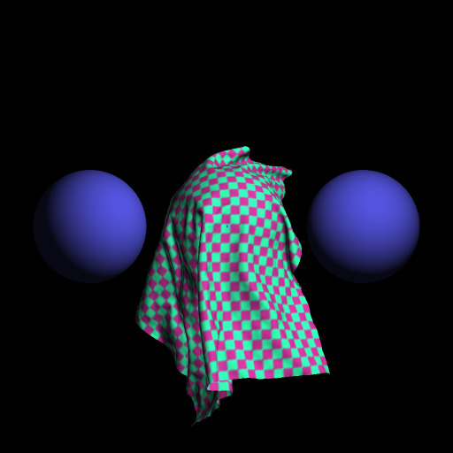

1. To use this repo, click the "use this template" green button above.
2. Install taichi: `pip3 install -r requirements.txt`.
3. Tweak with the code and add new features to it.
4. Submit your work in this [issue](https://github.com/taichi-dev/cloth-simulation-homework/issues/1).

Example:

  

----

# My work

新增按键：

按 s 暂停

##  Easy: 更改物理参数

调整不同的参数

将杨氏模量调整缩小100倍

效果为：布料伸缩性非常好

调整dashpot_damping

调大100倍：直接模拟不出来布料。

调小100倍：很难观察出明显效果

调整dt

调大100倍：布料在初始位置卡住不动

调小100倍：肉眼可见卡顿和帧率下降(12fps左右)

## Easy: 更改 vsync

更改 vsync=False

去掉帧率限制后

帧率达到350+

可见模拟显示速度也加快了

（类似快进效果）

## Medium

不会被刺穿：这点官方算例已经完成了

添加更多球

